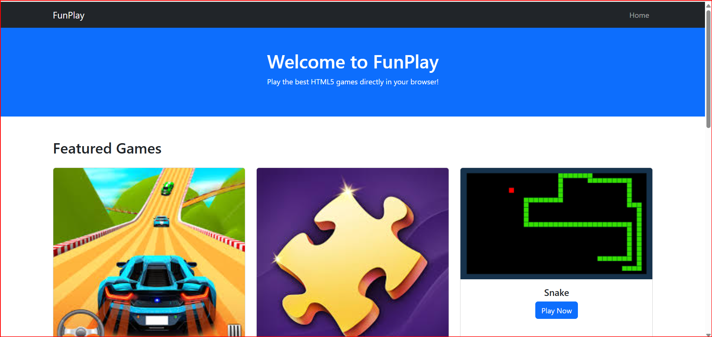
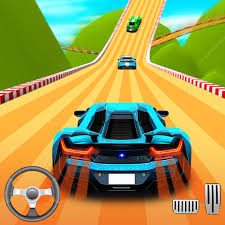

Got it — I’ll rewrite the README entirely in **clear English** so it’s GitHub-friendly and professional.

---

```markdown
# 🎮 GameHub - HTML, CSS & JavaScript Mini Games

**GameHub** is a simple frontend project containing multiple mini-games built with HTML, CSS, and JavaScript.  
No backend or server is required — just open it in your browser and start playing! 🚀

---

## 📸 Screenshots

### Home Page


### Car Racing Game


### Puzzle Master Game

and all 

---

## 🕹 Games Included
- 🚗 **Car Racing** – Speed up and avoid obstacles.
- 🧩 **Puzzle Master** – Arrange the pieces to complete the puzzle.
- 🎯 **More games coming soon...**

---

## ✨ Features
- 100% frontend — HTML, CSS & JS
- Mobile-friendly responsive design
- Clean UI using Bootstrap cards
- Easy to add new games
- Sound effects support (coming soon)

---

````

---

## 🚀 How to Play
1. Download or clone the project:
   ```bash
   git clone hhttps://github.com/raoshreepal/frontend-games-collection.git
````

2. Open the project folder.
3. Open **index.html** in your browser.
4. Click on any game and enjoy! 😄

---

## 📌 Note

If you load games from a **local JSON file**, the browser may block it due to CORS restrictions.
To fix this:

* Store the game data directly in `main.js` as an array, OR
* Run a local server (e.g., using the VS Code Live Server extension).

---

## 📄 License

Free to use and modify — credit is appreciated 👍

---

👨‍💻 **Developed by:** Rao Shreepal 
📧 Contact: [raoshreepal2012@gmail.com](mailto:raoshreepal2012@gmail.com)

```

---

If you want, I can also  
- create a **homepage screenshot** (`homepage.png`) for your README,  
- and add **two more game screenshots** for a complete look.  

Do you want me to make those images now so the README looks perfect?
```
